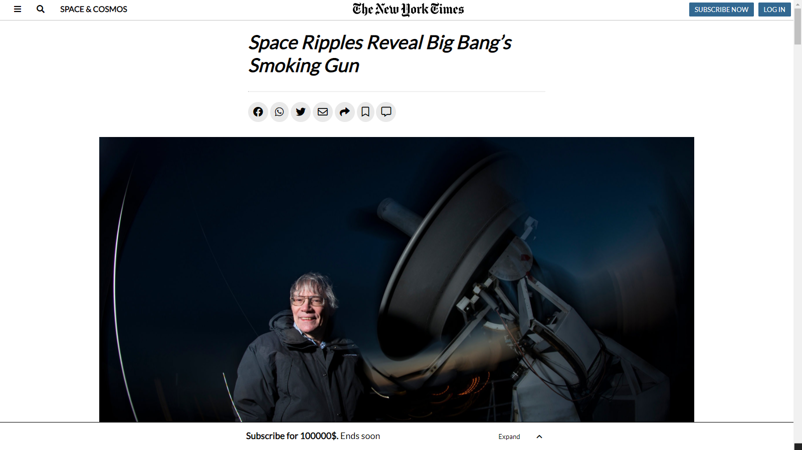

# Project 1: Positioning and Floating Elements - NYT Clone

> Applying what we have learned so far by cloning an NYT article.

This project is about cloning [this](https://www.nytimes.com/2014/03/18/science/space/detection-of-waves-in-space-buttresses-landmark-theory-of-big-bang.html?_r=0) NYT article by using different positioning techniques like Flex box, Floating elements and the Grid system.

## Built With

- HTML5
- CSS3

## Live Demo

[Live Demo Link](https://omar-labana.github.io/day1-project2-NYT/)

## Getting Started

**To get a local copy up and running follow these simple steps.**

### Prerequisites

-Web browser

### Setup

-Download/Clone the repository files and navigate to index.html.

### Install

-No installation required

### Deployment

-You can deploy this project by cloning it then:

- Goto the repository's settings.
- Navigate to GitHub Pages section.
- Select the appropriate branch.
- Submit your changes.

## Authors

👤 **Author1**

- GitHub: [@githubhandle](https://github.com/omar-labana)
- Twitter: [@Panda4cs](https://twitter.com/Panda4cs)
- LinkedIn: [LinkedIn](https://www.linkedin.com/in/omarlabana/)

## 🤝 Contributing

Contributions, issues, and feature requests are welcome!

Feel free to check the [issues page](issues/).

## Show your support

Give a ⭐️ if you like this project!

## Acknowledgments

- [Microverse](https://www.microverse.org/)
- [NYT](https://www.nytimes.com/)
- [The Odin Project](https://www.theodinproject.com)

## 📝 License

This project is [MIT](lic.url) licensed.
